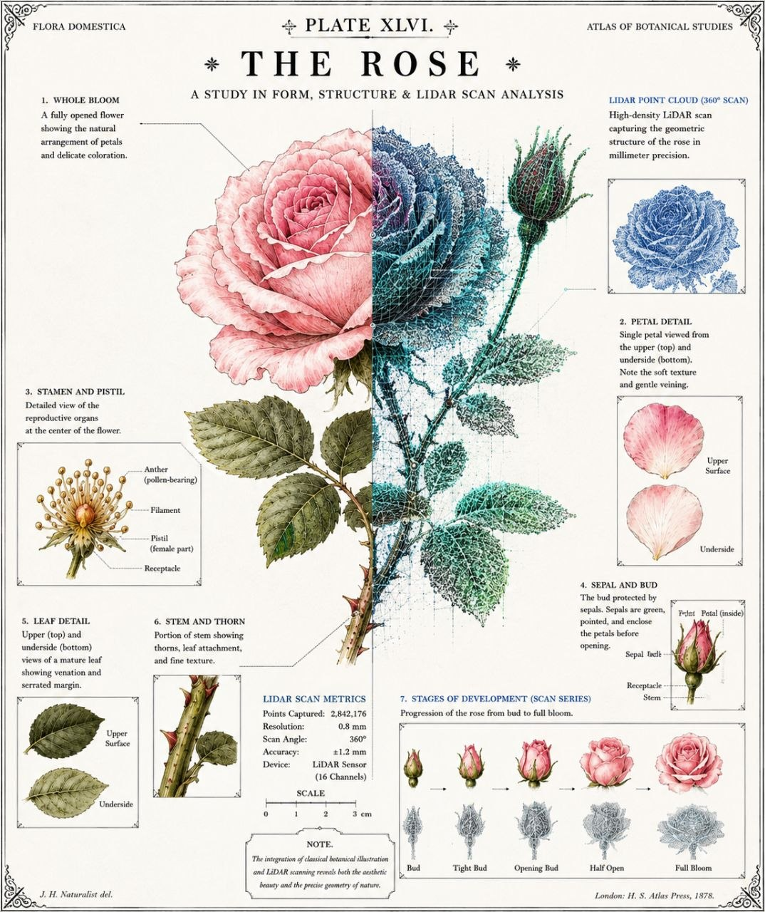

# 🔴 LiDAR Technology in the Hyperspace Ecosystem

**How 3D spatial sensing complements computer vision for next-generation precision floriculture.**

---



*Plate XLVI. The Rose — Classical botanical illustration meets modern LiDAR point cloud. The integration of 19th-century scientific illustration and 3D spatial sensing reveals both the aesthetic beauty and the precise geometry of nature. LiDAR scan metrics: 2,842,176 points captured at 0.8 mm resolution, ±1.2 mm accuracy, 16-channel sensor, 360° scan angle.*

---

## What is LiDAR?

**LiDAR** (Light Detection and Ranging) is a sensing technology that measures distances by illuminating a target with laser light and measuring the reflected pulses. The result: a **3D point cloud** — a digital twin of the physical world with millimeter-level accuracy.

| Sensor type | How it works | Range | Cost |
|---|---|---|---|
| Time-of-Flight (ToF) | Measures light round-trip time | 0.1–200 m | $100–10,000 |
| Structured Light | Projects pattern, reads deformation | 0.2–10 m | $50–500 |
| FMCW (Frequency Modulated) | Measures frequency shift | 1–300 m | $5,000–50,000 |
| Solid-State / MEMS | Micro-mirror scanning, no moving parts | 0.1–50 m | $200–2,000 |

---

## Why LiDAR + Computer Vision > Either Alone

The current Hyperspace system uses 11.9 MP RGB cameras (VineCam) + YOLOv8n on Hailo-8L for phenological stage detection. This is excellent for **counting and classifying blooms** in 2D. LiDAR adds a **third dimension** that cameras cannot provide:

| Capability | RGB Camera | LiDAR | Combined |
|---|---|---|---|
| Bloom detection (rose_small/large) | ✅ Excellent | ❌ No color | ✅ Camera leads |
| **Stem length measurement** | ❌ Requires scale reference | ✅ Direct 3D measurement | ✅ LiDAR leads |
| **Canopy volume / biomass** | ⚠️ Approximate (2D area) | ✅ True 3D volume | ✅ LiDAR + camera fusion |
| **Plant architecture (branching)** | ⚠️ Occlusion problems | ✅ Penetrates foliage gaps | ✅ Multi-angle fusion |
| Night operation | ❌ Requires LED illumination | ✅ Works in complete darkness | ✅ 24/7 monitoring |
| **Dew / water on lens** | ❌ Blurs image | ✅ Unaffected | ✅ Redundancy |
| Disease texture detection | ✅ Color + pattern | ❌ Geometry only | ✅ Camera leads |

---

## Three LiDAR Integration Levels for Hyperspace

### Level 1: Stem Length & Grade Classification

**Problem:** A Grade A export rose requires a 70–90 cm stem. Currently, stem length is estimated manually during cutting or inferred from 2D imagery with a reference object.

**LiDAR solution:** A low-cost **Time-of-Flight (ToF) sensor** mounted alongside each VineCam measures the Z-distance from camera to bud tip and from camera to stem base. The difference = stem length with ±2 mm accuracy.

| Sensor option | Accuracy | Cost/unit | Notes |
|---|---|---|---|
| VL53L5CX (ST) | ±2 mm @ 1 m | ~$15 | I²C, 8×8 multi-zone, ideal for 1 camera |
| TeraRanger Evo 60m | ±1 cm @ 10 m | ~$100 | UART, longer range, outdoor-rated |
| Intel RealSense L515 | ±1 mm @ 1 m | ~$350 | Full depth camera, overkill for single measurement |

**Integration:** VL53L5CX connects via I²C to the VineCam Hub alongside existing sensors (IMU, T/P/RH). Data flows into InfluxDB alongside bloom counts:

```
roses,node=cama_01 stem_length_avg=82.3,stem_length_std=4.1,grade_a_pct=0.87
```

### Level 2: Canopy Volume & Biomass Estimation

**Problem:** A healthy rose bed produces predictable biomass. A decline in canopy volume is an early warning of stress — **days before bloom count drops** or leaves visibly yellow.

**LiDAR solution:** A single **solid-state LiDAR** (e.g., Livox Mid-40, ~$600) mounted on a pole overlooking 4–8 beds captures a 3D point cloud of the canopy once per day. Volume change is tracked as a leading indicator:

```
Day 1:  Canopy volume = 2.4 m³/ha (baseline)
Day 30: Canopy volume = 2.1 m³/ha (▼ 12.5%) → ALERT: check irrigation/nutrients
```

- **3–5 day advance warning** before bloom count is affected
- Correlates with soil moisture sensor data for closed-loop irrigation
- Biomass = volume × density → yield prediction model input

### Level 3: Full Digital Twin of the Greenhouse

**Problem:** Managing a 10-hectare greenhouse requires spatial awareness of every bed's condition. Drones with photogrammetry are expensive and weather-dependent.

**LiDAR solution:** A **rotating 3D LiDAR scanner** (e.g., Ouster OS0, Velodyne Puck) on a fixed mast captures a complete point cloud of the greenhouse once per day. Combined with VineCam RGB images, this creates a **digital twin**:

- **Automated bed boundary detection** (no manual mapping)
- **Plant height heatmaps** overlaid on Grafana dashboard
- **Volume-based yield prediction** (not just bloom count)
- **Irrigation uniformity analysis** — is water reaching all plants equally?
- **Structural monitoring** — greenhouse frame deformation, polycarbonate panel integrity

| Component | Cost | Power |
|---|---|---|
| Livox Mid-40 (solid-state, 38.4° FOV) | ~$600 | 10W |
| Ouster OS0-128 (360° FOV, 128 beams) | ~$6,000 | 20W |
| Velodyne Puck (360° FOV, 16 beams) | ~$4,000 | 8W |

---

## Practical Integration Path

### Hardware: Adding LiDAR to the Existing Stack

The VineCam Hub already has I²C, UART, SPI, and USB ports available. LiDAR sensors connect via:

```
VineCam Hub (CM4 + RP2350)
  │
  ├── I²C ──→ VL53L5CX ToF sensor (per camera, stem length)
  ├── UART ──→ TeraRanger Evo (per bed, distance profiling)
  └── Ethernet ──→ Livox Mid-40 (per zone, 3D canopy scan)
                    │
                    └──→ ROS2 node on RPi5 (point cloud processing)
```

### Software: Point Cloud Processing Pipeline

```python
# /opt/hyperspace/lidar/canopy_volume.py
import open3d as o3d
import numpy as np

def compute_canopy_volume(pointcloud_path: str, ground_plane_z: float) -> dict:
    pcd = o3d.io.read_point_cloud(pointcloud_path)
    points = np.asarray(pcd.points)
    
    # Filter to above-ground points (canopy)
    canopy = points[points[:, 2] > ground_plane_z]
    
    # Compute convex hull volume
    hull = o3d.geometry.TriangleMesh.create_from_point_cloud_alpha_shape(
        o3d.geometry.PointCloud(o3d.utility.Vector3dVector(canopy)), alpha=0.05
    )
    volume_m3 = hull.get_volume()
    
    # Average canopy height
    avg_height = np.mean(canopy[:, 2] - ground_plane_z)
    
    return {
        "volume_m3": round(volume_m3, 3),
        "avg_height_m": round(avg_height, 3),
        "point_count": len(canopy)
    }
```

### Data Flow: Into the Existing Pipeline

```
03:00  VineCam captures RGB + ToF stem measurement
03:01  LiDAR captures 3D point cloud
03:02  RPi5 downloads RGB + point cloud data via REST
03:03  Hailo-8L: YOLOv8n on RGB (bloom stages)
       RPi5 CPU: Open3D on point cloud (canopy volume)
03:04  Fused metrics → InfluxDB
       bloom_count + stem_length + canopy_volume + bloom_ratio
03:05  Alerts if any metric crosses threshold
```

---

## Cost-Benefit Analysis

### Level 1: Stem Length (Tactical, low risk)

| Item | Cost |
|---|---|
| 4× VL53L5CX ToF sensors | $60 |
| Wiring + mounting brackets | $40 |
| Software integration (2 days) | — |
| **Total** | **~$100** |

**Value:** Automated Grade A/B classification → precise yield forecasting → better contract negotiation with buyers. ROI: immediate.

### Level 2: Canopy Volume (Strategic, medium investment)

| Item | Cost |
|---|---|
| 1× Livox Mid-40 | $600 |
| Mounting pole + enclosure | $150 |
| Software (canopy pipeline) | — |
| **Total** | **~$750** |

**Value:** 3–5 day advance warning of crop stress → prevents bloom count drops → saves $20,000–50,000 per incident on a 5-ha farm. ROI: single incident prevention pays for the system.

### Level 3: Digital Twin (Visionary, long-term)

| Item | Cost |
|---|---|
| 1× Ouster OS0 / Velodyne | $4,000–6,000 |
| Processing server upgrade | $500 |
| Digital twin software | — |
| **Total** | **~$6,500** |

**Value:** Full spatial intelligence → automated yield prediction, irrigation optimization, structural monitoring. Justifies itself at scale (10+ ha).

---

## LiDAR vs. Alternative 3D Sensing

| Technology | Accuracy | Outdoor? | Cost | Best For |
|---|---|---|---|---|
| **LiDAR (ToF)** | ±2 mm | ✅ | $15–600 | Stem length, single-point measurement |
| **LiDAR (scanning)** | ±1 cm | ✅ | $600–6,000 | Canopy volume, digital twin |
| Stereo camera depth | ±5 cm | ⚠️ Sunlight issues | $50–200 | Short range, controlled light |
| Photogrammetry (drone) | ±2 cm | ⚠️ Weather-dependent | $1,000–3,000 | Weekly surveys, not daily |
| Ultrasonic | ±1 cm | ✅ | $5–20 | Crude height, no 3D structure |

**Recommendation:** Start with Level 1 (ToF stem measurement). It's the highest-value, lowest-risk addition to the existing VineCam system. Level 2 (canopy LiDAR) is the natural next step once bloom monitoring is stable.

---

## Why This Belongs in Hyperspace

Hyperspace is not just a monitoring system — it's the **spatial intelligence layer for precision agriculture**. Cameras see color and shape. LiDAR sees distance and volume. Together, they provide:

- **2D + 3D fusion:** count blooms AND measure stems AND track biomass
- **Day + night operation:** cameras with LEDs by night, LiDAR works in darkness
- **Redundancy:** dew on camera lens? LiDAR still works. Dust on LiDAR? Camera still works
- **Data richness:** every bed becomes a time-series of 3D digital twins, not just 2D photos

The same RPi5 + Hailo-8L platform that runs YOLOv8n today can process point clouds tomorrow. The same InfluxDB + Grafana stack stores and visualizes both. LiDAR is not a replacement — it's the next dimension.

---

*Document generated May 17, 2026.*
*Project: Node.ec — Hyperspace Ecosystem.*
