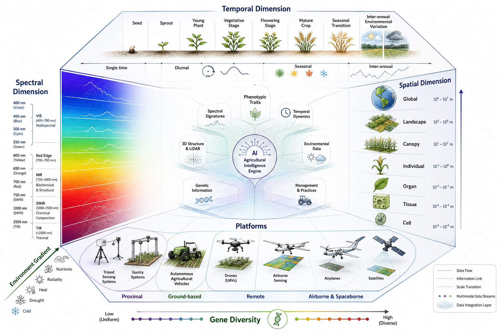

# 🌐 Multidimensional Plant Phenomics Data Space

> A conceptual hyperspace framework integrating spectral, temporal, spatial, environmental, and genetic dimensions for AI-powered precision agriculture.

---

## 📐 Diagram Overview

This scientific visualization represents the convergence of multimodal agricultural data streams into a unified **AI Agricultural Intelligence Engine**, structured as a semi-transparent 3D isometric hyperspace cube.

### 🔬 Dimensions

| Face | Dimension | Content |
|------|-----------|---------|
| **Left** | Spectral | Electromagnetic spectrum: VIS → Red Edge → NIR → SWIR → TIR |
| **Top** | Temporal | Crop phenology: Seed → Sprout → Vegetative → Flowering → Mature crop → Seasonal → Inter-annual |
| **Right** | Spatial | Biological hierarchy: Cell (10⁻⁶ m) → Tissue → Organ → Individual → Canopy → Landscape → Global (10⁷ m) |
| **Bottom** | Platforms | Sensing: Proximal → Ground-based → Remote → Airborne & Spaceborne |
| **Diagonal** | Environmental | Stressors gradient: CO₂, nutrients, radiation, heat, drought, cold |
| **Horizontal** | Genetic | Gene diversity: Low (Uniform) → High (Diverse) |

### 🧠 AI Integration

The central engine processes: Phenotypic Traits, Temporal Dynamics, Environmental Data, Management Practices, Genetic Information, 3D Structure / LiDAR, and Spectral Signatures.

---

## 🎯 Applications in Precision Agriculture

- **Multispectral & Hyperspectral Imaging** — NDVI, NDRE, disease detection, nutrient status
- **LiDAR & 3D Reconstruction** — Canopy structure, biomass, digital twins
- **Edge AI** — On-device inference with Hailo-8L (13 TOPS @ 5W), real-time field monitoring
- **Drone & Satellite Sensing** — Crop health mapping, yield prediction, stress detection
- **G×E×M Integration** — Genotype × Environment × Management interactions

---

## 🛠️ Related Projects

- **RoseAI Monitor** — Edge AI phenomics for rose cultivation (VineCam + Hailo-8L + 10BASE-T1S)
- **Node.ec** — Agricultural AI and computer vision services, Cayambe, Ecuador

---

*Style: Nature Biotechnology / NASA Harvest / Corteva Agriscience. Generated for Node.ec Agricultural Intelligence.*
