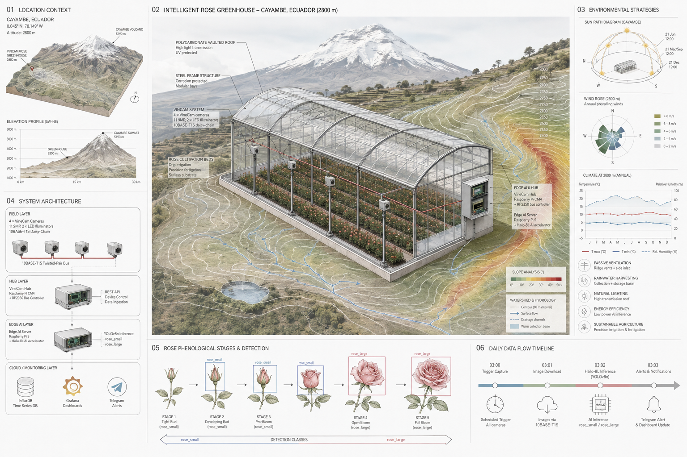
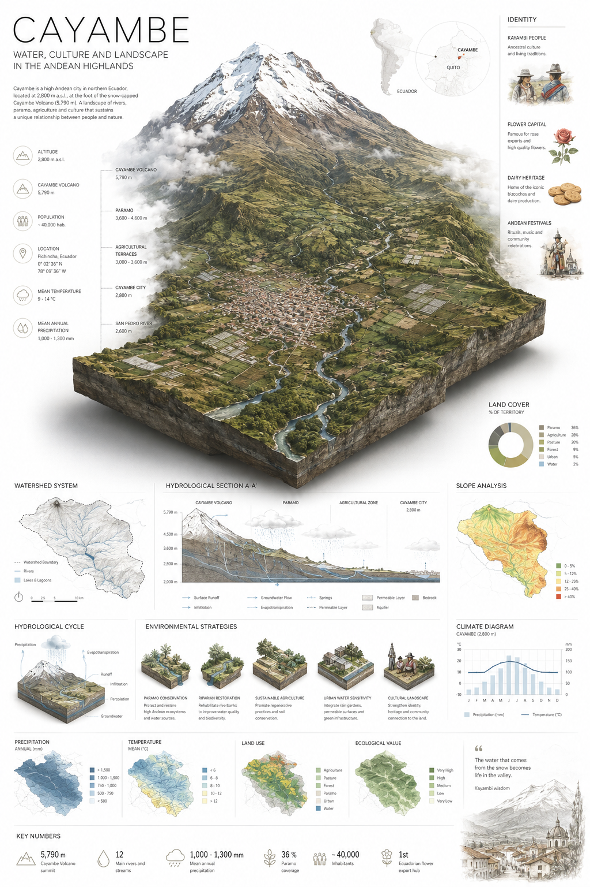

# 🌹 RoseAI Monitor — Monitoreo Inteligente de Cultivos de Rosas

**Sistema de visión artificial edge-AI para monitoreo de crecimiento y estado fenológico de rosas en campo, usando bus 10BASE-T1S MultiDrop y aceleración Hailo-8L.**

Hardware: Hellbender VineCam System (1 Hub + 4 Cámaras).

---

## 🎯 Objetivo del Proyecto

Automatizar el monitoreo diario de cultivos de rosas mediante el sistema VineCam de Hellbender — cámaras 11.9 MP distribuidas en campo conectadas por bus 10BASE-T1S con daisy-chain, con inferencia de etapas de floración (botón vs. flor abierta) ejecutada en un servidor RPi5 con acelerador Hailo-8L.

**Métricas clave:**
- Conteo de rosas por etapa fenológica (`rose_small`, `rose_large`)
- Ratio de floración (`large / total`)
- Alerta de cosecha cuando `rose_large > umbral`
- Opcional: detección de enfermedades (mildiú polvoriento, botrytis, mancha negra)

---

## 🏗️ Arquitectura General

*Implementación técnica — ver anexo técnico.*

**Kit base:** 1 Hub + 4 Cámaras = $1,049–$1,199 USD. Pre-order Spring 2026.

*Render conceptual: Invernadero inteligente de rosas con sistema VineCam + Hailo-8L en Cayambe, Ecuador.*

### Flujo de Datos Diario

*Implementación técnica — ver anexo técnico.*

### Componentes Internos del VineCam Hub

| Componente | Especificación |
|---|---|
| **CPU** | Raspberry Pi CM4 (Quad Cortex-A72 @ 1.5 GHz) |
| **RAM / Storage** | 2 GB / 32 GB eMMC |
| **MCU de bus** | RP2350 Dual Cortex-M33 @ 150 MHz — dedicado a 10BASE-T1S |
| **Acelerador IA** | Hailo-8 (opcional, requiere compra adicional) |
| **Puertos cámara** | 4× RJ45 10BASE-T1S (⚠️ pinout NO estándar, no conectar a otros dispositivos) |
| **Red externa** | 1× Gigabit Ethernet RJ45 + WiFi 5 (802.11ac) + BLE |
| **Sensores** | IMU (acelerómetro + giroscopio) + ambiental (Temperatura, Presión, Humedad) |
| **Alimentación** | 48V DC (conector Molex 6 pines) |
| **SO / API** | Linux + REST API + Web GUI de configuración |
| **Peso / Dims** | 390 g / 121 × 144 × 43 mm (montaje VESA 100×100) |

### Componentes Internos de cada VineCam Unit

| Componente | Especificación |
|---|---|
| **Sensor** | 11.9 MP, autofocus, rolling shutter |
| **FOV** | Opción 66°H×41°V o 102°H×67°V |
| **Iluminación** | 2× LEDs programables (control remoto desde el Hub) |
| **Conectividad** | 2× RJ45 10BASE-T1S con passthrough (daisy-chain) |
| **Alimentación** | 48V DC recibidos del Hub o de cámara anterior en la cadena |
| **Peso / Dims** | 121 g / 43 × 81 × 39 mm |
| **Montaje** | Rosca 1/4-20 (trípode) + 2× M3 |
| **Rango temp** | -20 a 65°C |

---

---

## ⚡ ¿Por qué Edge AI? Las Cinco Ventajas sobre la Nube

Este sistema está diseñado desde cero para **inferencia en el borde** — todo el procesamiento de IA ocurre localmente en la Raspberry Pi 5 + Hailo-8L, no en la nube. He aquí por qué esto importa en el campo:

### 1. Sin necesidad de internet

Las fincas de rosas en Cayambe están a 2,800 metros sobre el nivel del mar. La cobertura 4G es irregular en el mejor de los casos. Edge AI procesa cada imagen localmente — **cero dependencia de conectividad**. El sistema funciona haya señal celular o no.

### 2. Decisiones en tiempo real

Una rosa lista para cosecha tiene una **ventana óptima de corte de 24 horas**. Los viajes de ida y vuelta a la nube añaden segundos de latencia por imagen. La inferencia Edge en el Hailo-8L corre a **30 FPS** — la decisión ocurre en la cámara, no en un centro de datos a 5,000 km de distancia.

### 3. Soberanía de datos

Las imágenes de cultivos nunca salen de la finca. Sin costos de almacenamiento en la nube. Sin preocupaciones de privacidad. Sin riesgo de que datos agrícolas propietarios sean expuestos o monetizados. **El agricultor es dueño de sus datos, siempre.**

### 4. Costo a escala

| Enfoque | Costo mensual (4 cámaras, diario) |
|---|---|
| API en la nube (GPT-4V / Replicate) | ~$200–400/mes |
| **Edge AI (RPi5 + Hailo-8L)** | **$0/mes** después de la compra del hardware |

El acelerador Hailo-8L cuesta ~$70. Junto con una Raspberry Pi 5 (~$80), el servidor de inferencia completo cuesta **menos de $200 por única vez**, con cero tarifas recurrentes.

### 5. Eficiencia energética

| Dispositivo | Rendimiento | Consumo |
|---|---|---|
| Hailo-8L | 13 TOPS | **5W** |
| NVIDIA Jetson Nano | 0.5 TOPS | 5–10W |
| GPU en la nube (A100) | 312 TOPS | 300W (por solicitud) |

El Hailo-8L ofrece **26× más TOPS-por-vatio** que un Jetson Nano. Puede funcionar 24/7 con un pequeño panel solar — crítico para despliegues agrícolas remotos.

### Bonus: La ventaja 10BASE-T1S

El sistema VineCam utiliza un solo bus de par trenzado para datos y alimentación. Un solo cable se extiende en cadena a través del campo. Sin switches Ethernet. Sin puntos de acceso WiFi. Sin repetidores. Esta es infraestructura diseñada para **condiciones agrícolas reales**, no para salas de servidores climatizadas.

## 🔌 Conexión 10BASE-T1S

### ¿Por qué 10BASE-T1S?

El VineCam Hub de Hellbender utiliza 10BASE-T1S como bus de campo. Ventajas sobre alternativas:

| Criterio | 10BASE-T1S | Alternativas |
|---|---|---|
| **Velocidad** | 10 Mbps | WiFi: inestable en campo, requiere APs |
| **Topología** | Bus MultiDrop / Daisy-chain | Ethernet 100BASE: requiere switch ($) |
| **Cableado** | 1 solo par trenzado | CAN/RS-485: no tienen TCP/IP |
| **Alimentación** | 48V DC sobre el mismo cable | LoRaWAN: 50 kbps, sin TCP/IP |
| **Latencia** | Determinística (PLCA) | WiFi: alta variabilidad |
| **Alcance** | 25 m total del bus | Suficiente para invernadero/cama de cultivo |

**Ventaja decisiva:** Un solo cable lleva datos + alimentación. Sin switches, sin repetidores. Ideal para campo agrícola.

### Estándar

IEEE 802.3cg-2019, capa física 10BASE-T1S:
- 10 Mbps half-duplex sobre par trenzado único
- Topología bus MultiDrop: hasta 8 nodos, ≤25 m
- PLCA (Physical Layer Collision Avoidance): acceso determinístico al medio
- SPoE vía IEEE 802.3bu (Power over Data Lines, Clase 5 hasta 13W)

### Cómo lo implementa VineCam

Hellbender usa un **RP2350** (Dual Cortex-M33 @ 150 MHz) como co-procesador dedicado exclusivamente al bus 10BASE-T1S. Esto libera al CM4 de la gestión en tiempo real de PLCA y timing del bus.

*Implementación técnica — ver anexo técnico.*

**Arquitectura de conexión de cámaras (daisy-chain con passthrough):**

*Implementación técnica — ver anexo técnico.*

Cada cámara tiene 2 puertos RJ45 10BASE-T1S y retransmite datos + 48V a la siguiente. No requiere switch ni cableado en estrella.

⚠️ **El pinout RJ45 de VineCam NO es estándar.** Solo conectar entre Hub y VineCam Units — nunca a otros dispositivos 10BASE-T1S.

---

## 📷 Cámaras VineCam — Operación

### Captura de Imágenes (control vía REST API del Hub)

*15 líneas de código de implementación — ver anexo técnico.*

### Resolución y Detección

Sensor 11.9 MP. A 1 m de altura sobre las rosas: ~0.28 mm/píxel.

| Objeto | Tamaño real | Píxeles | Detectable |
|---|---|---|---|
| Botón de rosa (rose_small) | 15-30 mm | 54-107 px | ✅ Excelente |
| Rosa abierta (rose_large) | 50-100 mm | 179-357 px | ✅ Excelente |
| Áfidos (plaga) | 2-3 mm | 7-11 px | ⚠️ Marginal |
| Mildiú polvoriento | 2-5 mm | 7-18 px | ⚠️ Requiere alta resolución |
| Botrytis (lesiones) | 5+ mm | 18+ px | ✅ Posible |

---

## 🧠 Modelo de IA

**Dataset:** RoseBlooming (Shinoda et al. 2023) — 519 imágenes aéreas, 2 clases COCO: `rose_small` (botón), `rose_large` (flor abierta).

**Arquitectura:** YOLOv8n entrenado en GPU → exportado a ONNX → compilado a Hailo `.hef` para el acelerador Hailo-8L. Inferencia en edge con DeGirum PySDK.

**Performance esperada:** mAP@0.5: 0.85–0.92, ~30 FPS en Hailo-8L.

---

## 📊 Monitoreo y Visualización

### Stack de Observabilidad

| Componente | Propósito |
|---|---|
| **InfluxDB** | Almacenar series temporales: conteos diarios por nodo, ratio de floración |
| **Grafana** | Dashboard con gráficos de evolución fenológica, mapas de calor por cama |
| **Telegram Bot** | Alertas de cosecha lista, anomalías (sin floración, enfermedad) |
| **JSON diario** | Respaldo local en `/opt/data/roses/YYYY-MM-DD/results/` |

### Métricas en InfluxDB

*Implementación técnica — ver anexo técnico.*

### Umbrales y Alertas

| Condición | Alerta | Acción |
|---|---|---|
| `rose_large > 20` (por nodo) | 🔴 Cosecha urgente | Telegram + email |
| `rose_large > 5` (por nodo) | 🟡 Cosecha próxima | Telegram |
| `bloom_ratio > 0.7` | 🟢 Pico de floración | Log + dashboard |
| `total == 0` (3 días seguidos) | ⚠️ ¿Cámara caída? | Telegram |
| `rose_small / total < 0.1` | 🔵 Fin de ciclo de floración | Dashboard |

---

## 📅 Cronograma

| Hora | Acción |
|------|--------|
| 03:00 | Trigger de captura en las 4 cámaras + descarga de imágenes |
| 03:02 | Inferencia batch con Hailo-8L → métricas a InfluxDB |
| 03:10 | Limpieza de imágenes > 30 días |
| 08:00 | Reporte matutino vía Telegram |

---

## 🧪 Expansiones Futuras

### Detección de Enfermedades

Modelos adicionales ejecutados en paralelo sobre las mismas imágenes:

| Enfermedad | Dataset | Modelo |
|---|---|---|
| Mildiú polvoriento | PlantVillage / anotación manual | YOLOv8n (fine-tune) |
| Botrytis | Imágenes propias de campo | YOLOv8n (fine-tune) |
| Mancha negra | PlantDoc / anotación manual | YOLOv8n clasificación |

**Alternativa:** Un solo modelo multiclase (5 clases: rose_small, rose_large, black_spot, powdery_mildew, botrytis) entrenado con dataset combinado.

### Dashboard en Tiempo Real

- Grafana con consultas a InfluxDB
- Panel de "mapa de camas" con indicadores visuales
- Línea de tiempo de floración por cultivar
- Exportación de reportes PDF semanales

### Control de Riego y Clima

- Integración con sensores de humedad de suelo (I²C)
- Control de válvulas de riego vía GPIO
- Correlación riego ↔ velocidad de floración
- Posible integración con Home Assistant

---

*Render: Cayambe — Agua, Cultura y Paisaje. Integración del invernadero en el paisaje andino.*

## 📚 Referencias

### Paper y Dataset
- [RoseTracker: A system for automated rose growth monitoring (2023)](https://doi.org/10.1016/j.atech.2023.100271)
- [RoseBlooming-Dataset en GitHub](https://github.com/dahlian00/RoseBlooming-Dataset)
- [Google Drive con dataset completo](https://drive.google.com/drive/folders/1I7_3vqDzZNIPwwqqOph1MrEqo8ZxAy0r)

### 10BASE-T1S
- IEEE 802.3cg-2019 — Physical Layer specification
- IEEE 802.3bu — Power over Data Lines (PoDL)

### Hailo y DeGirum
- [DeGirum + Hailo Guide](https://docs.degirum.com/hailo)
- [Hailo DFC (Dataflow Compiler)](https://github.com/hailo-ai/hailo-dfc)
- [Hailo RPi5 Examples](https://github.com/hailo-ai/hailo-rpi5-examples)
- [DeGirum PySDK Examples](https://github.com/DeGirum/PySDKExamples)

### Hellbender VineCam
- [VineCam System — Página de producto](https://hellbender.com/product/vinecam-system/)
  - Hub: CM4 + RP2350 (bus controller dedicado) + Hailo-8 opcional
  - Cámaras: 11.9MP, 2× LEDs programables, daisy-chain 10BASE-T1S con passthrough
  - 4 puertos 10BASE-T1S (RJ45, pinout no estándar) + Gigabit Ethernet + WiFi 5 + BLE
  - IMU + sensor T/P/RH integrados en el Hub
  - REST API para control y descarga de imágenes
  - 1 Hub + 4 Cámaras = $1,049–$1,199 USD. Pre-order Spring 2026. Diseñado y ensamblado en USA.

---

## 📁 Estructura del Proyecto

*28 líneas de código de implementación — ver anexo técnico.*

---

*Documento generado el 16 de mayo de 2026.*
*Proyecto: Node.ec — Servicios de monitoreo inteligente para agricultura de precisión.*
